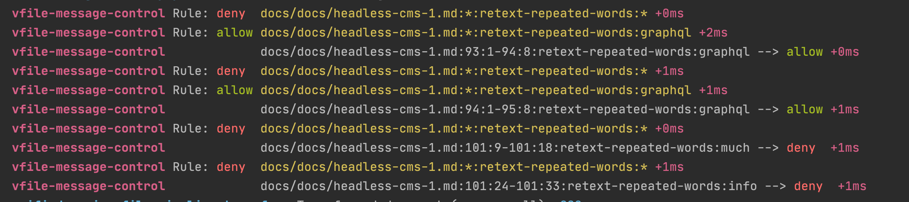

# vfile-message-control

remark-lint plugin to filter messages from other linters.

it uses https://github.com/isaacs/minimatch.

## `id`

the id is calculated from the filename and rule name and the location of the message and optional an parameter defined by `optionName`

## Options

### Option `deny`

an array of minimatch globs to remove messages  

### Option `allow`

an array of minimatch globs to keep messages (evaluated after deny)  

### Option `stripPathPrefix`

an array remove from the start of the calculated id  

### Option `optionName`

an string for an option appended to the id    

## Examples

Example configuration:

```javascript
    [
      "vfile-message-control",
      {
        "deny":[
          "docs/docs/headless-cms-1.md:*:retext-repeated-words:*",
        ],
        "allow": [
          "docs/docs/headless-cms-1.md:*:retext-repeated-words:graphql",
        ],
      }
    ],
```



## Note

It not removes messages from plugins which attach to FileSet with `fileSet.use()` like `remark-validate-links`.